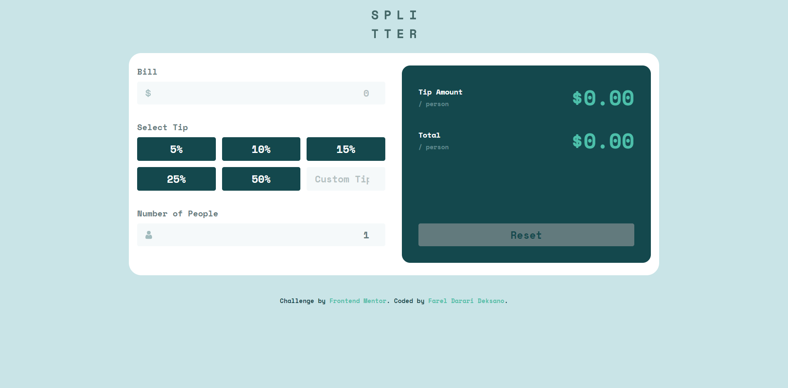

# Frontend Mentor - Tip calculator app solution

This is a solution to the [Tip calculator app challenge on Frontend Mentor](https://www.frontendmentor.io/challenges/tip-calculator-app-ugJNGbJUX). Frontend Mentor challenges help you improve your coding skills by building realistic projects.

## Table of contents

- [Overview](#overview)
  - [The challenge](#the-challenge)
  - [Screenshot](#screenshot)
- [My process](#my-process)
  - [Built with](#built-with)
  - [What I learned](#what-i-learned)
- [Author](#author)

**Note: Delete this note and update the table of contents based on what sections you keep.**

## Overview

### The challenge

Users should be able to:

- View the optimal layout for the app depending on their device's screen size
- See hover states for all interactive elements on the page
- Calculate the correct tip and total cost of the bill per person

### Screenshot

**Desktop Preview**


**Mobile Preview**


### Links

- Solution URL: [Add solution URL here](https://your-solution-url.com)
- Live Site URL: [Add live site URL here](https://your-live-site-url.com)

## My process

### Built with

- Semantic HTML5 markup
- CSS custom properties
- Flexbox
- CSS Grid
- Mobile-first workflow
- Javascript

### What I learned

Its a quite challenging project

What i learn from this project is to build function for each goals. I don't is good way or a bad way. I already try to use one function to try calculate the result but i didn't made it.

What i love about this project that i build is, its simple but not that simple. like example is when the user want to input the custom tip, to selected tip before go unselect. and its quite challenging to do that for me.

Here's how i achieve that goals :

```JS
function customTipInput() {
  if (!customTip.value == "") {
    tip = Number(customTip.value) / 100;
    for (let i = 0; i < tipSelect.length; i++) {
      if (tipSelect[i].checked) {
        tipSelect[i].checked = false;
      }
    }
  }
  getResult(tip, bill, people);
}
```

I also learn to use

```
num.toFixed(2);
```

it will help us to determine how many number behind the decimal

and many more i learned from this project

## Author

- Frontend Mentor - [@fareldeksano](https://www.frontendmentor.io/profile/digiT000)
- Linkedin - [@fareldeksano](https://www.linkedin.com/in/fareldeksano/)
